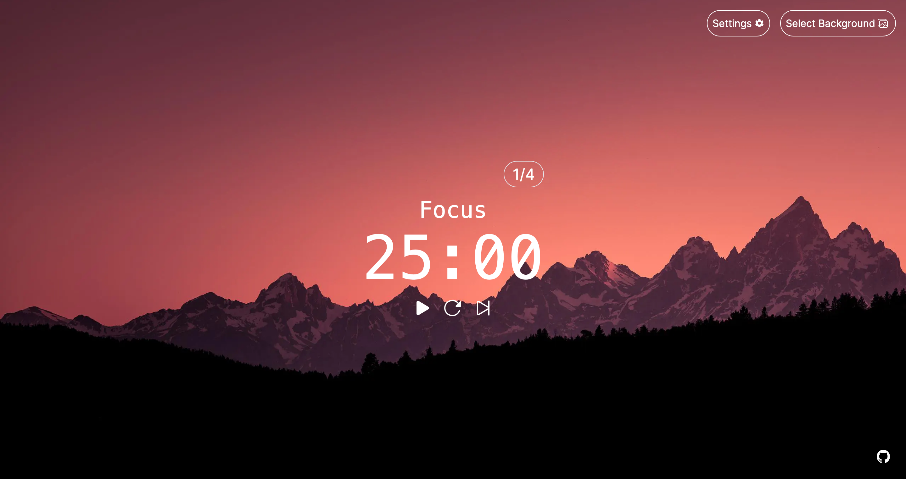

[](https://www.pomodorotimer.me/)

# Pomodoro Timer

## Overview

Very simple pomodoro timer aimed for simplicity and productivity. Built using Next.js and HeroUI. The project is live [here](https://www.pomodorotimer.me/).

## Features 
- **🖥️ Simple Interface**: A clean and intuitive interface that's easy to use.
- **🎯 Accurate Timer**: The timer suffers minimally from clock drift that is common in pomodoro web apps, even when the tab is not active.
- **⚙️ Customizable Timer**: Adjust the work, short break and long break duration as well as the number of rounds per iteration.
- **🏞️ Changeable Background**: Tired of the current background? Pick another one!
- **📝 Task List**: Simple task list for tracking your current todos.

## Possible additional features
- **Tracking pomodoros and reports**

## Installing locally

For those interested in running the Pomodoro Timer locally, first clone the repository:
```bash
git clone https://github.com/srefsland/pomodoro-timer.git
```

Install dependencies:
```bash
cd pomodoro-timer
npm install
```

Start the development server:
```bash
npm run dev
```

The development server is now live at http://localhost:3000.

## License

This project is released under the [MIT License](LICENSE.md).
